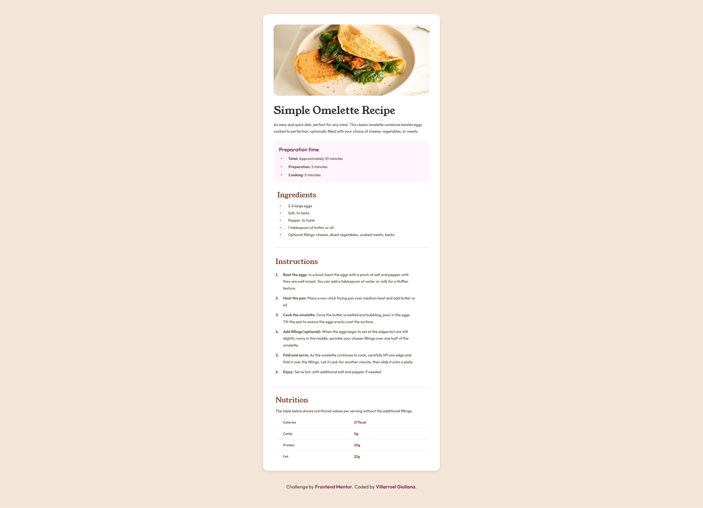

# Recipe Page | Frontend Mentor

This is a solution to the [Recipe Page challenge on Frontend Mentor](https://www.frontendmentor.io/learning-paths/getting-started-on-frontend-mentor-XJhRWRREZd/steps/68a5211a186ba06a54bb02f5/challenge/start). Frontend Mentor challenges help you improve your coding skills by building realistic projects. 

## Table of Contents

- [Overview](#overview)
  - [What I learned](#what-i-learned)
- [Built with](#built-with)
- [Features](#features)
- [Acknowledgements](#acknowledgements)
- [Author](#author)

## Overview

This is my take on a recipe page that actually works well whether you're cooking on your phone in the kitchen or browsing recipes on your laptop. It's designed with all the usual stuff you'd expect - a nice hero image, ingredient lists, cooking steps, and some nutritional info.

### What I learned

- **Getting the HTML right**: I used proper HTML elements like `<article>` and `<section>` because it actually matters for screen readers and SEO. Plus it just makes more sense when you're marking up a recipe.
- **Making text that actually works**: Spent way too much time tweaking font sizes and spacing. But now the ingredients are easy to read when you're grocery shopping on your phone, and the instructions don't overwhelm you when you're trying to cook.
- **Starting mobile, then going bigger**: Working mobile-first was actually liberating. When you have limited space, you focus on what really matters. Scaling up to desktop was much easier after that.

## Built with

- HTML5 Semantic Elements
- CSS3 Mobile-First Design
- CSS Flexbox for Component Alignment
- Responsive Typography System
- CSS Custom Properties (Variables)
- Structured Content Markup
- Accessibility Best Practices

## Features

- **Works on any device**: Started with mobile in mind, then made sure it looks good on bigger screens too. No weird layouts or tiny text.
- **Actually semantic HTML**: Used the right HTML elements so screen readers work properly and search engines understand what's what.
- **Text that makes sense**: The typography has a clear order - you can easily scan ingredients, follow instructions, and not get confused about what's important.
- **Proper recipe structure**: Ingredients, steps, and nutrition info are all marked up correctly, which is good for accessibility and might even get you those fancy Google recipe cards.

This was a fun project that reminded me how important it is to think about how people actually use websites. When someone's cooking, they need information fast and clear - no time for fancy animations or confusing layouts.

## Acknowledgements

- [Frontend Mentor](https://www.frontendmentor.io/challenges) for creating practical projects that build real-world frontend skills

## Author

- Website [recipe page](#)
- GitHub [@gvillarroel-dev](https://github.com/gvillarroel-dev)